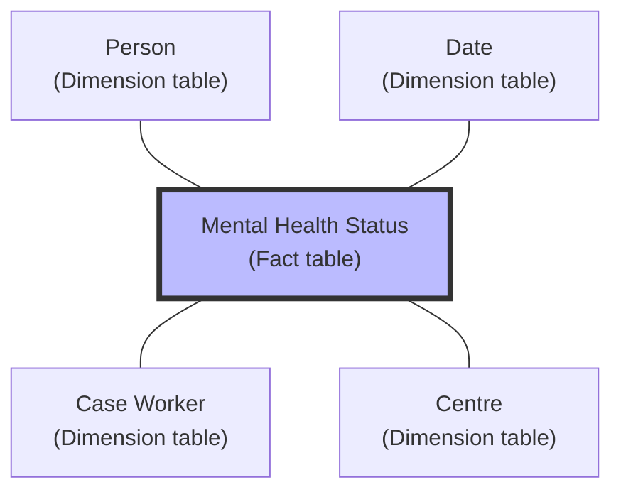
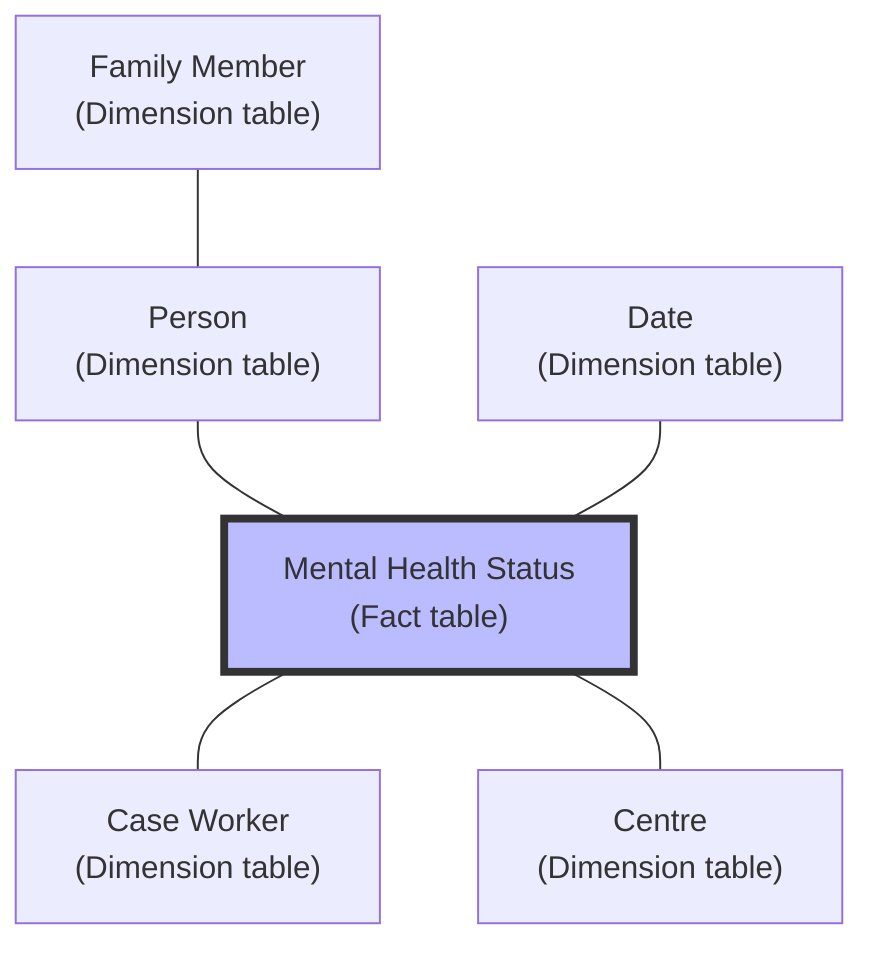

---
# try also 'default' to start simple
theme: seriph
background: ''
title: Introduction to Excel and Power BI
lineNumbers: true
#class: text-center
# https://sli.dev/custom/highlighters.html
highlighter: shiki
# https://sli.dev/guide/drawing
drawings:
  persist: false
# slide transition: https://sli.dev/guide/animations#slide-transitions
transition: slide-left
# enable MDC Syntax: https://sli.dev/guide/syntax#mdc-syntax
favicon: 'https://bokss.org.hk/content/logo/icon.png'
mdc: true
layout: intro
# author field for exported PDF
author: Ka Long CHAN
# keywords field for exported PDF, comma-delimited.
keywords: excel,powerbi,datascience
download: '/excel-power-bi.pdf'
selectable: true
colorSchema: light
exportFilename: excel-power-bi
---

# Introduction to Excel and Power BI

<style>
.slidev-layout h1 {
  margin-left: 0rem;
  font-size: 3.5rem
}
p {
  margin-top: 0rem;
  margin-bottom: 0rem;
  margin-left: 0rem;
  margin-right: 0rem;
}
</style>

BOKSS IMHS Internal Training

30-May-2024 @ K83 & Zoom

---
transition: fade-out
layout: section
---

# Chapter 1

<style>
    h1, p {
    margin-left: 0rem;
  }
</style>

Basic Concept of Data Science

---
transition: fade-out
---

# Data is everywhere

<div style="display: flex;justify-content: center;"></div>

---
transition: fade-out
---

# Type of Data

- Structured Data vs unstructured data
- Quantitative vs. qualitative data

---
transition: fade-out
layout: two-cols-header
---

# Structured vs unstructured data


::left::

## Structured data
  - Organized
  - Tabular format
  - Predefined structure
  - Text and numbers

::right::

## Unstructured data
  - Unorganized
  - No specific format
  - No predefined structure
  - Text, images, audio, video

---
transition: fade-out
layout: two-cols-header
---

# Structured vs unstructured data

::left::

## Structured data
| Name      | Age | Gender |
|-----------|-----|--------|
| James     | 16  | Male   |
| Elizabeth | 14  | Female |
| Thomas    | 17  | Male   |

::right::

## Unstructured data
There are three students named James, Elizabeth, and Thomas. Their respective genders and ages are male 16, female 14, and male 17.

---
transition: fade-out
layout: two-cols-header
---

# Quantitative vs. qualitative data


::left::

## Quantitative data
  - Numberical data
  - Count, measure, percentage

## Examples
  - Age
  - Temperature
  
::right::

## Qualitative data
  - Categorical data
  - Group into categories

## Examples
  - Gender
  - Holiday

---
transition: fade-out
---

# Workflow of Data Science

“R for Data Science” (Wickham and Grolemund 2017)


---
transition: fade-out
layout: two-cols-header
---

# Workflow of Data Science


::left::

## Import

- Open the file using one software
  - .csv / .tsv / .txt
  - .xlsx / .xls
  - .json

::right::

## Tidy

- Format in tabular
  - Every column is a variable
  - Every row is an observation
  - Every cell has a single value


---
transition: fade-out
layout: two-cols-header
---

# Workflow of Data Science


::left::

## Transform

- Create new column
- Re-group categories
- Filter your sample
- Combine tables
- Handle missing data

::right::

## Visualize

- Get the insight of your data
- Check the data quality
  - Missing (Completeness)
  - Validity / Accuracy


---
transition: fade-out
layout: two-cols-header
---

# Workflow of Data Science


::left::

## Modeling

- Descriptive (Business Intelligence)
- Out-of-scope
  - Predictive (Machine Learning)
  - Interference (Statistic)


::right::

## Communicate

- Making (interactive) dashboard
  - Excel, Google sheet
  - Power BI, Looker, Tableau
  - R, Python


---
transition: fade-out
layout: two-cols-header
---

# Common data cleaning challenges

<style>
  ul {
    width: 200%
  }
</style>

::left::

- Missing data
- Inconsistent
  - units
  - format
  - spelling variations
  - typo

::right::

- Outliers and errors
- Duplicate
- Unstructured
- Wrong data types

---
transition: fade-out
---

# 3-R's in data science

<div style="display: flex; justify-content: center;">

</div>

---
transition: fade-out
layout: section
---

# Chapter 2

<style>
    h1, p {
    margin-left: 0rem;
  }
</style>

Some Basic Tricks of Excel

---
transition: fade-out
layout: two-cols-header
---

# Edit, Copy and Paste

<style>
  ul {
    width: 200%
  }
</style>

::left::

## Method 1
1. Select the cell
2. Make your edit, copy, or paste
3. When you are editing, **arrow** keyboard will select other cell

<br>

## Remark
- You can only use the same method to copy and paste

::right::

## Method 2
1. Double click (F2) the cell
2. Make your edit, copy, or paste
3. When you are editing, **arrow** keyboard will be as usual

---
transition: fade-out
layout: two-cols-header
---

# Referencing


::left::

## Absolute referencing
- **constant** when copied to other cell
```ts
=$A$2 / =A$2 / =$A2
```

<SlidevVideo controls style="width: 80%"><source src="/absolute_referencing.mov"></SlidevVideo>

::right::

## Relative referencing
- **change** when copied to other cell
```ts
=A2 / =Sheet1!A2
```

<SlidevVideo controls style="width: 80%"><source src="/relative_referencing.mov"></SlidevVideo>

---
transition: fade-out
---

# Other topic
- Multiple lines in one cell
- Freeze cell
- Custom format
- F4 Hotkey
- Resize width and height
- Paste special

---
transition: fade-out
---

# Multiple lines in one cell
- Press Alt + Enter

<SlidevVideo controls style="height: 60%"><source src="/multi-line.mov"></SlidevVideo>

---
transition: fade-out
---

# Freeze cell
- View ->
	- Freeze Panes (Custom the Freezing behavior)
	- Freeze Top Row
  	- Freeze First Column


---
transition: fade-out
layout: two-cols
---

# Formatting

- Build-in format
- Custom format
- Using formula

```ts
=TEXT(A2, "[$-404]aaaa")
```

[reference-date-format](https://thomasjao.gitbooks.io/excel/content/entry_data.html)

::right::

<div style="display: flex"></div>

---
transition: fade-out
layout: two-cols-header
---

# F4 Hotkey


::left::

- Make previous action

<SlidevVideo controls style="height: 60%"><source src="/f4-repeat.mov"></SlidevVideo>

::right::

- Change referencing style

<SlidevVideo controls style="height: 60%"><source src="/f4-change-referencing.mov"></SlidevVideo>

---
transition: fade-out
---

# Resize width and height
1. Select all
2. Double click the height line or width line

<SlidevVideo controls style="height: 60%"><source src="/resize-width-height.mov"></SlidevVideo>

---
transition: fade-out
layout: two-cols
---

# Paste special
- Transpose
- Values

::right::

<div></div>

---
transition: fade-out
layout: section
---

# Chapter 3

<style>
    h1, p {
    margin-left: 0rem;
  }
</style>

Using Table in Excel

---
transition: fade-out
layout: two-cols-header
---

# Feature of Table in Excel

::left::

- Column header row
  - Unique header name
- Body
- Total row
  - Disable by default
  - Build-in function (SUM / AVERAGE)
  - Custom function

::right::


---
transition: fade-out
---

# Benefit of using Table

## Structured referencing
- Automatically updates as data is added

```ts
=[@colName]
```
<br>

## Data quality
- Automatically add new column
- Build-in filtering and sorting
- Data validation automatically updates
- Re-size table to add or remove data

---
transition: fade-out
layout: section
---

# Chapter 4

<style>
    h1, p {
    margin-left: 0rem;
  }
</style>

Basic Functions in Excel

---
transition: fade-out
layout: two-cols-header
---

# Type of functions in Excel

::left::

- Operations
- Command button in Ribbon
  - Data validation
  - Conditional formatting
  - Remove duplicates
  - Flash fill
  - Split text to columns

::right::

- Function
  - Aggregate
  - Text
  - Date & Time
  - Maths
  - Logical
  - Lookup

---
transition: fade-out
layout: two-cols-header
---

# Operations

::left::

| Symbol | Operation                |
|--------|--------------------------|
| +      | Addition                 |
| -      | Subtraction              |
| *      | Multiplication           |
| /      | Division                 |
| ^      | Exponentiation           |

::right::

| Symbol | Operation                |
|--------|--------------------------|
| >      | Greater than             |
| <      | Less than                |
| >=     | Greater than or equal to |
| <=     | Less than or equal to    |
| <>     | Not equal                |
| =      | Equal to                 |

---
transition: fade-out
---

# Aggregate function
```ts
=SUM(A2:A10)
=AVERAGE(A2:A10)
=MAX(A2:A10)
=MIN(A2:A10)
=COUNT(A2:A10)
=COUNTBLANK(A2:A10)
```

---
transition: fade-out
---

# Text function
```ts
=LEFT()
=RIGHT()
=TRIM()
=CLEAN()
=CONCAT()
=CONCATENATE()
=TEXTJOIN()
=TEXTSPLIT()
=UPPER()
=LOWER()
=PROPER()
=LEN()
=REPLACE()
=SUBSTITUTE()
```

---
transition: fade-out
layout: two-cols-header
---

# Date & Time function

::left::

## Date
```ts
=DATE()
=YEAR()
=MONTH()
=DAY()
=DAYS()
=TODAY()
=WEEKDAY()
=WEEKNUM()
```

::right::

## Time
```ts
=TIME()
=NOW()
=HOUR()
=MINUTE()
=SECOND()
```

---
transition: fade-out
---

# Maths function
```ts
=ROUND()
=ABS()
=INT()
```

---
transition: fade-out
---

# Logical function
```ts
=AND()
=OR()
=NOT()
=ISNUMBER()
=ISERROR()
=ISERR()
=ISBLANK()
=IF()
=IFS()
=IFERROR()
```

---
transition: fade-out
layout: two-cols-header
---

# Logical + Aggregate function

::left::

## \[Aggregate]\[Logical]()
```ts
=COUNTIF()
=COUNTIFS()
=SUMIF()
=SUMIFS()
=AVERAGEIF()
=AVERAGEIFS()
```

::right::

## D\[Aggregate]()
```ts
=DMAX()
=DMIN()
```

---
transition: fade-out
---

# Lookup function
```ts
=VLOOKUP()
```

---
transition: fade-out
---

# Other useful function

```ts
=INDEX()
=INDIRECT()
=OFFSET()
=LARGE()
=SMALL()
=ROW()
=ROWS()
=COLUMN()
=COLUMNS()
=CHOOSE()
=SEARCH()
=FIND()
=MATCH()
```

---
transition: fade-out
---

# Other useful function only in Excel 2021 or Excel Web

```ts
=SORT()
=SORTBY()
=UNIQUE()
=FILTER()
=XLOOKUP()
=XMATCH()
=SWITCH()
```

---
transition: fade-out
layout: two-cols-header
---

# Wildcards in Excel

::left::

Use to match pattern in function
- Find and Replace
- Conditional Formatting
- Filter
- SEARCH()
- XMATCH()
- \[Aggregate]\[Logical]()

::right::

|  Symbol   | Meaning  |
|  ----  | ----  |
| ?  | 1 character |
| *  | 0 or more character |
| ~  | Escape whilcards |

---
transition: fade-out
---

# Use case

- Find the unique value
- Combine two table (Vlook + Column)
- Data validation with function
- Conditional formatting with function

---
transition: fade-out
---

# Pivot Tables

## Benefit
- Aggregate and organize data in dynamic tables
- Transform rows to columns, or vice versa
- Group, filter, aggregate without need to make changes

---
transition: fade-out
layout: section
---

# Chapter 5

<style>
    h1, p {
    margin-left: 0rem;
  }
</style>

Power Query in Excel

---
transition: fade-out
---

# Big data era

<div style="display: flex; justify-content: center;"></div>

---
transition: fade-out
---

# Benefit of power query

- Combine data from different source
- Keep track of every step in the workflow
- Easy to do every step in workflow
- Update the analytics when the data source update
- Ensure the reproducibility

---
transition: fade-out
---

# Import data

- Single file
- Multiple files with same structure
- Multiple sheets in Excel with same structure
- File from Onedrive Business (BOKSS)


---
transition: fade-out
---

# Transform
- Modify current column
- Add new column


---
transition: fade-out
---

# Load
- Load to excel sheet
- Load to excel connection


---
transition: fade-out
---

# Combine query
- Merge (Join or map)
- Append


---
transition: fade-out
---

# Different type of join
- Full join
- Left join or right join
- Inner join
- Anti join

---
transition: fade-out
---

# Full join

<div style="display: flex; justify-content: center;"></div>

---
transition: fade-out
---

# Left join (Right join)

<div style="display: flex; justify-content: center;"></div>

---
transition: fade-out
---

# Inner join

<div style="display: flex; justify-content: center;"></div>

---
transition: fade-out
---

# Anti join

<div style="display: flex; justify-content: center;"></div>

---
transition: fade-out
layout: statement
---

# Make your decision

---
transition: fade-out
layout: section
---

# Chapter 6

<style>
    h1, p {
    margin-left: 0rem;
  }
</style>

Power BI Navigation

---
transition: fade-out
layout: two-cols-header
---

# Report View

::left::

1. Canvas
2. Filters Pane
3. Visualization Pane
    -  Build visual
    - Format page
4. Data Pane
5. Page Overview

::right::

</img>

---
transition: fade-out
layout: two-cols-header
---

# Table View

::left::

1. Data Grid
2. Data Pane
3. DAX Formula bar
4. Table Tools

::right::

</img>

---
transition: fade-out
layout: two-cols-header
---

# Model View

::left::

1. Data Model
2. Data Pane
3. Properties Pane

::right::

</img>

---
transition: fade-out
---

# DAX Query View

<div style="display: flex; justify-content: center;">
</img></div>

---
transition: fade-out
layout: two-cols-header
---

# Power Query Editor

::left::

1. Query Editor Ribbon
2. Queries Pane
3. Query Setting
4. Status Bar
5. Table Pane

::right::

</img>

---
transition: fade-out
layout: two-cols-header
---

# Drilling Down

::left::

1. Date
    - Auto create Date Table
    - Mark as Date Table
    - Using DAX
    - Using Power Query (M)
2. Custom Hierarchies
    - Department -> Unit -> Team

::right::

</img>

---
transition: fade-out
layout: two-cols-header
---

# Filter

::left::

1. Visual Level
2. Page Level
3. Report Level
4. Slicer
5. Interactions

::right::

</img>

---
transition: fade-out
layout: two-cols-header
---

# Sorting

::left::

1. Sort in Table View
2. sort in Visual
3. Sort by column

::right::

</img>

---
transition: fade-out
layout: section
---

# Chapter 7

<style>
    h1, p {
    margin-left: 0rem;
  }
</style>

DAX in Power BI

---
transition: fade-out
---

# What is DAX
- **D**ata **A**nalysis e**X**pressions
- Based on Excel formulas and functions
- Create calculated columns, measures, tables
- DAX reference
  - [https://docs.microsoft.com/en-us/dax/dax-function-reference](https://docs.microsoft.com/en-us/dax/dax-function-reference)

---
transition: fade-out
---

# Calculated columns
- Calculate at row level
- Add new column to existing table
- Based on Excel formulas and functions
- Calculate when data is refreshed
```dax
new_column = Sales[Price] + Sales[Tax]
```

---
transition: fade-out
---

# Calculated measures
- Aggregates multiple rows
- Add a new field for visualization
- Calculated when you interact with the visuals
- Two ways
    - from scratch
    - use Quick Measure

---
transition: fade-out
---

# Context of DAX

<div style="margin-left: 1.5rem"></div>

[reference](https://learn.microsoft.com/en-us/power-bi/transform-model/desktop-calculations-options)

---
transition: fade-out
---

# Row Context

- Use current row (all row)
- Custom column (M language)
- Calculated columns
```dax
Sales[Price] * Sales[Tax]
```


---
transition: fade-out
---

# Filter Context

- Filter before calculation is carried out
- Calculated measures
    - Aggregates on the calculated columns

```dax
SUM(Sales[Profit])

SUMX(<table>, <expression>)
SUMX(Sales, Sales[Price] * Sales[Tax])
SUMX(FILTER(Sales, Sales[Region]="EMEA"), Sales[Price] * Sales[Tax])

CALCULATE(<expression>, <filter1>, ...other filter conditions)
CALCULATE(SUM(Sales), Sales[Region]="EMEA")
```

---
transition: fade-out
---

# VAR and RETURN

- Useful for complax calculation

```dax
Sales YoY Growth % =
DIVIDE(
    ([Sales] - CALCULATE([Sales], PARALLELPERIOD('Date'[Date], -12, MONTH))),
    CALCULATE([Sales], PARALLELPERIOD('Date'[Date], -12, MONTH))
)
```

```dax
Sales YoY Growth % =
VAR SalesPriorYear =
    CALCULATE([Sales], PARALLELPERIOD('Date'[Date], -12, MONTH))
RETURN
    DIVIDE(([Sales] - SalesPriorYear), SalesPriorYear)
```

---
transition: fade-out
layout: section
---

# Chapter 8

<style>
    h1, p {
    margin-left: 0rem;
  }
</style>

M language in Power BI

---
transition: fade-out
---

# What is M language

- programme language use in Power Query
- all action in Power Query will be convert to M language
- You can write M language manually in
  - Custom Column
  - Formula bar
  - Advanced Editor
- M language reference
  - [https://learn.microsoft.com/en-us/powerquery-m/](https://learn.microsoft.com/en-us/powerquery-m/)

---
transition: fade-out
layout: section
---

# Chapter 9

<style>
    h1, p {
    margin-left: 0rem;
  }
</style>

Power Query in Power BI

---
transition: fade-out
layout: two-cols-header
---

# Data preview

::left::

- Quick analyze the data in power query
- Helps diagnose errors and inconsistencies
- Helps you decide what transformation(s) to use

::right::

<div></div>

---
transition: fade-out
---

# Data Transform
- Pivot column : reshape data for report
- unpivot column: reshape data for data analysis
- Transpose: swap column and row name
- Group by

---
transition: fade-out
layout: section
---

# Chapter 10

<style>
    h1, p {
    margin-left: 0rem;
  }
</style>

Data Model in Power BI

---
transition: fade-out
---

# What is data model

- Tables
- Columns
- Data types
- Relationship between tables
- Keys

---
transition: fade-out
layout: two-cols-header
---

# Star Schema

::left::

- Facts table: metrics
    - Facts (measures)
    - Keys: use to build relationship between tables
- Dimensions table: context
- Benefit
  - Reduce file size
  - Reduce redundant data
  - Easy to manage

::right::



---
transition: fade-out
layout: two-cols-header
---

# Fact table

::left::

- Make up of 
    - Facts (measures)
    - Keys: use to build relationship between tables
- Fact tables are long and narrow
    - Lots of rows
    - Fewer columns

::right::

| id | centre_id | depression_scure
|---|---|---|
| 1 | 1 | 10 |
| 2 | 1 | 15 |
| 3 | 2 | 12 |
| 4 | 2 | 19 |
| 5 | 3 | 20 |

---
transition: fade-out
layout: two-cols-header
---

# Dimension table

::left::

- Provide context
- Shared concepts
- Contain static data
- Dimension tables are short and wide
    - Few of rows
    - Lots of columns

::right::

| centre_id | name_centre | district_centre |
|---|---|---|
| 1 | ICCMW (Kwai Tsing) | KT |
| 2 | ICCMW (Wan Chai) | WC |
| 3 | ICCMW (Eastern) | HKE |

---
transition: fade-out
layout: two-cols-header
---

# Snowflake Schema

::left::

- Allows relationships between dimensions
- Fact table(s) remain the same
- Benefit
  - Reduce file size
  - Reduce redundant data
  - Easy to manage

::right::



---
transition: fade-out
layout: two-cols-header
---

# Build data model in Power BI

::left::

- Power BI will define relationship automatically
- You can also define relationship between tables in Model View
  - One-to-many relationship
  - Many-to-many relationship
  - One-to-one relationship
- Each pair of table can have more than one relationship

::right::


---
transition: fade-out
---

# Build data model in Power BI

- If more than one relationships
  - Set the active relationship in Model View
  - using DAX to activate the relationship when calculating a measure

```dax
= CALCULATE(SUM(InternetSales[SalesAmount]), USERELATIONSHIP(InternetSales[ShippingDate], DateTime[Date]))
```

---
transition: fade-out
layout: section
---

# Chapter 11

<style>
    h1, p {
    margin-left: 0rem;
  }
</style>

Advanced use case in Power BI

---
transition: fade-out
---

# Advanced use case in Power BI

- Button and action
- Mobile View
- Publish
- Drill-through and tooltip
- Bookmark

---
transition: fade-out
---

# Button and action

- Create a App-like experience
- Add action to buttons
- Actions
  - Nagative between pages
  - Filter
  - Bookmark

---
transition: fade-out
layout: section
---

# Chapter 12

<style>
    h1, p {
    margin-left: 0rem;
  }
</style>

Integration with Other Microsoft Product

---
transition: fade-out
---

# Integration
- Microsoft Power Automate
- Microsoft Forms
- Microsoft Fabric
- Microsoft Power App (Less use in our case)

---
transition: fade-out
---

# Microsoft Forms + Power Automate

1. Collect data using Forms
1. Data of Microsoft Forms -> Excel (Power Automate)
2. Add workflow to the Forms
    - Send email
    - Make approval
    - Add new column
    - Conditional control

---
transition: fade-out
---

# Microsoft Fabric
1. Excel data -> Lakehouse (Dataflow)
2. Power BI or Notebook
3. Create Scorecard / Alert
4. Trigger another workflow using Power Automate
